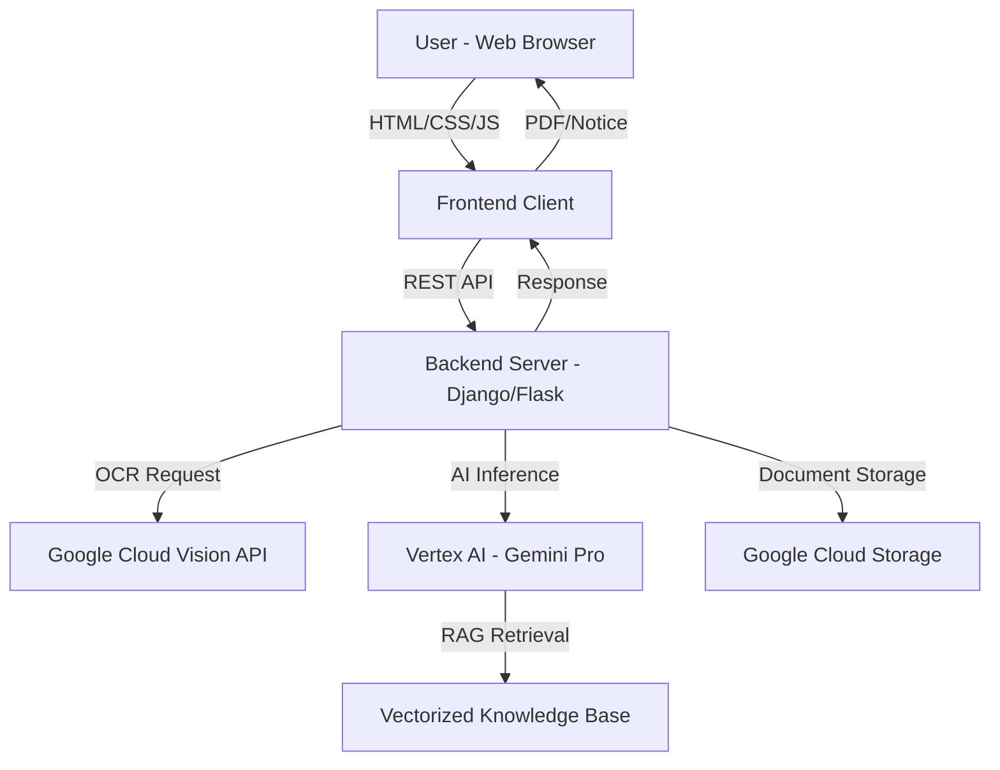

# NYAYA-SAHAYAK - TECHNICAL STACK DOCUMENTATION

## Project Overview
**NYAYA-SAHAYAK** (Network Yielding AI for Justice & Awareness Sahayak) is a multimodal Retrieval-Augmented Generation (RAG) platform that automates legal notice generation and preliminary case analysis for common legal disputes in India.

---

## 🎨 FRONTEND TECHNOLOGIES

### Core Technologies
| Technology | Version/Type | Purpose |
|------------|--------------|---------|
| **HTML5** | ES6+ | Semantic markup and structure |
| **CSS3** | Modern CSS | Styling and animations |
| **JavaScript** | Vanilla ES6+ | Client-side logic and interactivity |
| **Tailwind CSS** | CDN (Latest) | Utility-first CSS framework |

### UI/UX Libraries & APIs
| Library/Service | Purpose |
|-----------------|---------|
| **Font Awesome** | v6.5.1 - Icons and visual elements |
| **Google Fonts API** | Typography (Space Grotesk, Inter, Merriweather, Playfair Display) |
| **Web Audio API** | Sound effects and audio feedback |
| **Web Speech API** | Voice input (Hindi/English) |

### Frontend Features
- **Responsive Design:** Mobile-first, fully responsive across devices
- **CSS Animations:** Keyframe animations, transitions, glassmorphism effects
- **Interactive Elements:** Drag-and-drop file upload, voice input, real-time chat
- **Visual Effects:** Grid backgrounds, glitch effects, gradient animations, Ashoka Chakra watermark
- **Accessibility:** Voice input support, bilingual interface (Hindi/English)

---

## ⚙️ BACKEND TECHNOLOGIES

### Core Technologies
| Technology | Version | Purpose |
|------------|---------|---------|
| **Python** | 3.9+ | Primary backend language |
| **Django** | 6.0.0 | Web framework for MVC architecture |
| **Flask** | Latest | RESTful API server (alternative/microservices) |
| **Jinja2** | Latest | Server-side templating engine |

### Google Cloud Platform (GCP) Services
| Service | API | Purpose |
|---------|-----|---------|
| **Vertex AI** | Vertex AI API | Agent Builder for RAG pipeline |
| **Gemini Pro 1.5** | LLM API | Legal reasoning, drafting, and generation |
| **Cloud Vision** | Cloud Vision API | OCR for document text extraction |
| **Cloud Storage** | Cloud Storage API | Document storage and knowledge base indexing |

### Backend Architecture
- **Microservices-Oriented:** Modular components for scalability
- **RESTful API:** JSON-based endpoints for frontend-backend communication
- **OCR Layer:** Image-to-text extraction from scanned documents
- **Inference Engine:** AI-powered legal analysis and notice generation
- **RAG Knowledge Base:** Vectorized Indian laws (IPC, CrPC, Consumer Protection Act)

---

## 🗄️ DATA & KNOWLEDGE BASE

### Legal Knowledge Sources
- **Indian Penal Code (IPC)** - Criminal law sections
- **Code of Criminal Procedure (CrPC)** - Procedural guidelines
- **Consumer Protection Act 2019** - Consumer rights and remedies
- **Rental Agreement Laws** - Tenant-landlord disputes
- **Insurance Claim Laws** - Policy and claim regulations

### Data Processing
- **Document Upload:** PDF, JPG, PNG support
- **OCR Processing:** Google Cloud Vision for text extraction
- **Vector Indexing:** Vertex AI Search for RAG retrieval
- **Multimodal Input:** Text, voice, and image processing

---

## 🔐 AUTHENTICATION & SECURITY

### Security Features
| Feature | Implementation |
|---------|----------------|
| **Service Account** | GCP Service Account Key (`key.json`) |
| **IAM Roles** | Storage Admin, Vertex AI User |
| **Data Privacy** | End-to-end encryption (conceptual) |
| **Secure Sessions** | Django session management |

---

## 📦 DEPLOYMENT & VERSION CONTROL

### Development Tools
| Tool | Purpose |
|------|---------|
| **Git** | Version control and collaboration |
| **GitHub** | Code repository and CI/CD |
| **Virtual Environment** | Python dependency isolation |

### Deployment Requirements
- **Python 3.9+** - Runtime environment
- **GCP Project** - Active Google Cloud project with enabled APIs
- **Service Account** - Credentials with proper IAM roles
- **Environment Variables** - API keys and configuration

---

## 🎯 KEY TECHNICAL FEATURES

### 1. **Multimodal Input Processing**
- Text input via chat interface
- Voice input (Hindi/English) via Web Speech API
- Document upload with drag-and-drop UI
- Image OCR for scanned documents

### 2. **AI-Powered Legal Analysis**
- **RAG Pipeline:** Retrieval-Augmented Generation for accurate legal references
- **Gemini Pro 1.5:** Large Language Model for legal drafting
- **Probabilistic Scoring:** AI confidence/win probability gauge
- **Evidence Cross-Verification:** Automated document authenticity checks

### 3. **Notice Generation System**
- Structured legal notice templates
- Indian law citation (IPC, Consumer Act)
- PDF download functionality
- Reference number and date stamping

### 4. **Real-Time Processing**
- Animated system logs during AI analysis
- Progress indicators and loading states
- Ticker-based fraud heatmap visualization
- Smooth state transitions (gateway → intro → app)

---

## 🌐 INTEGRATION SUMMARY

---

## 📊 TECHNOLOGY STACK SUMMARY

### **Frontend:**
- HTML5, CSS3, JavaScript (ES6+), Tailwind CSS
- Font Awesome, Google Fonts, Web APIs (Audio, Speech)

### **Backend:**
- Python 3.9+, Django 6.0.0, Flask, Jinja2
- RESTful API architecture

### **AI/ML:**
- Google Vertex AI (Agent Builder)
- Google Gemini Pro 1.5 (LLM)
- Google Cloud Vision API (OCR)
- RAG (Retrieval-Augmented Generation)

### **Cloud Infrastructure:**
- Google Cloud Platform (GCP)
- Cloud Storage for documents
- Vertex AI Search for knowledge indexing

### **Version Control:**
- Git, GitHub

---

## 💡 INNOVATION HIGHLIGHTS

1. **Smart Education Approach:** Learning through practical legal problem-solving
2. **Bilingual Support:** Hindi and English for accessibility
3. **Constitution-Themed UI:** Navy/Gold palette with Ashoka Chakra symbolism
4. **One-Click Legal Notice:** Automated generation ready for dispatch
5. **Evidence Intelligence:** AI-powered document verification and consistency checking

---

**Developed By:**  
Bhumi Kansal, Krishna Sharma, Mayank Balyan, Shreyas Singh, Vishal Singh  
Faculty of Technology, University of Delhi  
**Theme:** Smart Education
